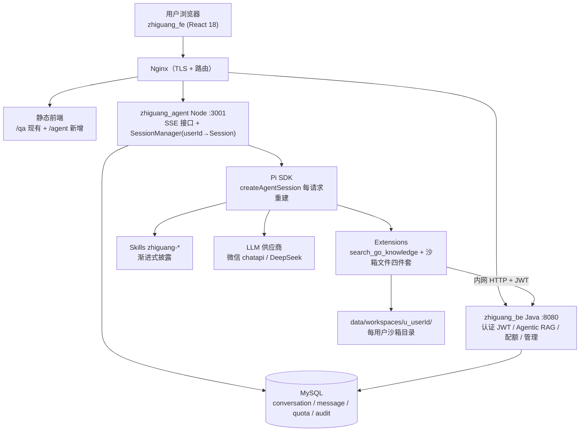

# 知光 AI 助手（Pi Agent）产品与架构设计

> 版本：v0.2（已拍板稿）
> 状态：D1/D3/D4 与 Q1-Q4 已于 2026-09-19 拍板（见第 10 节决策记录）；文档维护辅助技能 architecture-documenter 已安装
> 用途：本文档是后续开发与面试叙述的**唯一依据**；任何范围变更先改本文档再动代码，避免开发中反复讨论重复问题。

---

## 0. 文档目的

对齐"做一个类豆包的多用户 AI 助手，嵌入知光网站"这件事的**需求边界、安全边界、技术决策**。
开发中遇到"这个要不要做/怎么做"的争议，先回本文档查；文档没有的，讨论后**补进文档**再开发。

---

## 1. 产品定位与范围

### 1.1 定位

- 形态：嵌入知光网站的 **多用户 AI 助手**（对标豆包的对话体验），面向互联网注册用户
- 双入口平行架构：
  - **入口 1 `/qa`**：传统 RAG 问答（现有能力，零改动）
  - **入口 2 `/agent`**：通用 Agent 对话（新增，Pi Agent 驱动）
- Agent 能力（v1）：知识问答（调知光 RAG）、用户工作区文件操作（读/写/列表/删）、业务 Skill 模板化回答
- Agent 能力（v2 预留）：联网搜索、PPT/报告生成、代码执行沙箱

### 1.2 非目标（v1 明确不做，防范围蔓延）

- ❌ 代码执行沙箱（Docker 容器级隔离）——v2 再做，v1 直接禁 shell
- ❌ 计费 / 会员 / 付费额度
- ❌ 多模型切换 UI
- ❌ 语音 / 图像输入
- ❌ 移动端 App
- ❌ 多机部署 / K8s（v1 单机，v2 docker-compose）

---

## 2. 核心概念

| 概念 | 定义 | 生命周期 |
|---|---|---|
| **User** | 知光注册用户，复用 zhiguang_be 用户体系与 JWT | 永久 |
| **Conversation** | 一次对话（含标题、消息列表），用户可建多个 | 永久（MySQL） |
| **Message** | 对话中的一条消息（user/assistant/tool），含 tool_trace | 永久（MySQL） |
| **Session（运行时）** | Pi `AgentSession` 对象，**每次请求临时重建**，跑完即弃 | 请求级（内存） |
| **Workspace** | 每用户独占沙箱目录 `data/workspaces/u_{userId}/`，Agent 文件工具唯一可操作区 | 永久（磁盘 + 配额） |
| **Skill** | Anthropic Agent Skills 规范的业务说明书（`.pi/skills/zhiguang-*/SKILL.md`） | 文件，热加载 |
| **Tool** | Extension 注册的自定义工具（沙箱文件四件套 + search_go_knowledge） | 服务级 |

**关键设计**：Session 是**请求级临时对象**，不是长驻对象。历史真相在 MySQL，Pi Session 每次从最近 N 条消息重建。
理由：Node 服务无状态 → 可水平扩展、可重启不丢数据、内存不随用户数膨胀。

---

## 3. 总体架构



### 3.1 请求链路（/agent 一次对话）

1. 浏览器带 JWT 请求 `POST /api/agent/chat`（SSE）
2. Node 验 JWT → 得 userId → 查/建 Conversation
3. Node 从 MySQL 加载最近 12 条消息 → `createAgentSession()` 重建 Pi Session 并注入历史
4. Pi ReAct 循环：按 Skill 清单决策 → 调工具（search_go_knowledge / 沙箱文件工具）
5. 工具事件经 SSE 推给前端（"正在检索知识库…""正在写入文件…"）
6. 答案流式推送；结束后新消息落 MySQL、扣配额、写审计日志
7. Session dispose，内存释放

### 3.2 为什么 Node 不直接暴露给公网用户数据

Node 只持有"对话运行时"；用户身份、配额、RAG、管理全在 Java。Node ↔ Java 走内网 + JWT，Node 被攻破也拿不到用户库。

---

## 4. 功能需求清单（v1）

| 编号 | 功能 | 说明 |
|---|---|---|
| F1 | 流式对话 | SSE + Markdown 渲染 + 引用溯源（复用 react-markdown） |
| F2 | 会话管理 | 列表 / 新建 / 重命名 / 删除 / 历史续聊 |
| F3 | Agent 工具集 | `search_go_knowledge`（Java RAG）+ 沙箱文件四件套 |
| F4 | Skills | zhiguang-* 业务 Skill，渐进式披露 |
| F5 | 过程可视化 | 前端展示 agent_step 事件（检索/写文件/加载技能） |
| F6 | 配额 | 磁盘 / Token / 并发三限额 |
| F7 | 审计 | 工具调用全量留痕（谁/何时/何工具/何路径/结果） |
| F8 | 用户背景记忆 | v1 仅会话历史；v2 做跨会话用户画像记忆 |

---

## 5. 安全与隔离设计（重点对齐）

> 用户核心诉求：**用户不能跳出自己的工作文件夹，不能看到服务器文件夹或其他用户文件**。

### S1 路径沙箱（六条铁律）

所有文件工具入参必须过 `resolveSafePath(userRoot, input)`：

1. **只接受相对路径**；出现绝对路径（`C:\`、`/`、`D:\`、`~`）直接拒绝
2. **拒绝 `..` 段**
3. `path.resolve(userRoot, input)` 结果必须 `startsWith(userRoot + sep)`
4. **realpath 校验**防符号链接逃逸（链接指向沙箱外 → 拒绝）
5. 写操作前查**配额与单文件大小上限**
6. 工具 `cwd` 强制为 userRoot，工具 description 明示"只能操作你的工作区"

### S2 v1 禁 shell（根除逃逸类问题）

- Pi 配置 `noTools: "builtin"` —— **禁用全部内置工具**（含 bash / powershell，以及接受绝对路径的内置 read/write/edit）
- 只保留 Extension 注册的自定义工具（全部走 S1 沙箱）
- 理由：内置 bash 可 `cd ..`、`cat /etc/passwd`、`curl` 外传数据，任何路径校验都防不住 shell
- v2 若需代码执行：Docker 容器 per-session（挂载该用户 workspace、断网、CPU/内存限额）

### S3 会话与数据隔离

- 每请求验 JWT → userId；Session Map 与 Workspace 均以 userId 为键
- 跨用户访问 Conversation / Workspace 一律 403
- 日志脱敏：用户消息内容不入明文日志，只记 digest

### S4 资源配额（建议值，待确认）

| 项 | 建议值 |
|---|---|
| 磁盘 / 用户 | 100 MB |
| 单文件 | 10 MB |
| Token / 用户 / 天 | 免费 20 万 token |
| 并发 Session / 用户 | 2 |
| 全局 LLM 并发 | 信号量 10 |

### S5 内容安全

- v1：敏感词黑名单（前置拦截）+ System Prompt 红线（后置约束）
- v2：接云内容安全 API（阿里云/腾讯云）做输入输出双审

### S6 审计

`tool_audit` 表全量记录工具调用；管理端可按用户/时间检索（复用 zhiguang_be 管理后台模式）。

---

## 6. 关键设计决策

| 编号 | 决策 | 结论 | 状态 |
|---|---|---|---|
| D1 | 会话历史唯一真相 | MySQL message 表；Pi Session 每请求重建 | 已拍板 |
| D2 | 认证 | 复用 zhiguang_be RS256 JWT，Node 持公钥验签，不另做登录 | 已定 |
| D3 | Workspace 存储 | 服务器本地磁盘 + 配额；多机时迁 OSS | 已拍板 |
| D4 | v1 代码执行 | 不做，禁 shell；v2 Docker 沙箱 | 已拍板 |
| D5 | 部署 | v1 单机 nginx+java+node；v2 docker-compose | 已定 |
| D6 | 协议 | 浏览器↔Node SSE；Node↔Java 内网 HTTP | 已定 |

---

## 7. 数据模型（新增表，挂现有 MySQL）

```sql
conversation(id PK, user_id, title, created_at, updated_at)
message(id PK, conversation_id, role, content MEDIUMTEXT,
        tool_trace JSON, tokens INT, created_at)
user_quota(user_id PK, disk_used_bytes BIGINT,
           tokens_today BIGINT, quota_date DATE, updated_at)
tool_audit(id PK, user_id, conversation_id, tool_name,
           params_digest VARCHAR(64), result_status, cost_ms, created_at)
```

---

## 8. 接口契约

### 8.1 浏览器 ↔ Node（SSE 事件）

| 事件 | 载荷 | 用途 |
|---|---|---|
| `meta` | conversationId | 前端绑定会话 |
| `agent_step` | stepName, title(中文), status | 过程可视化（F5） |
| `message` | delta | 答案流式 |
| `done` | tokensUsed | 结束 + 配额展示 |
| `error` | code, msg | 异常 |

### 8.2 Node ↔ Java（内网）

- `POST /internal/rag/search` {query, topK} → 检索结果（复用 RagMainAgent）
- `GET /internal/users/{id}/quota` → 配额校验
- JWT 验签：Node 用 zhiguang_be 的 RS256 公钥

---

## 9. 里程碑

| 阶段 | 内容 | 状态 |
|---|---|---|
| M1 | Pi CLI 跑通 | ✅ 完成 |
| M2 | 多用户 Session 隔离验证脚本 | 待做 |
| M3 | Extension + Skill 在 CLI 接通 Java RAG | 待做 |
| M4 | Node Agent 服务（SSE + Session 管理 + 沙箱工具） | 待做 |
| M5 | 前端 /agent 页面 | 待做 |
| M6 | 配额 + 审计 + 内容安全基础 | 待做 |
| M7 | 联调演示 + 文档复盘 | 待做 |

---

## 10. 决策记录（2026-09-19 拍板）

- **Q1 代码执行**：v1 不做，禁 shell（`noTools:"builtin"`）；v2 代码执行走 Docker 每会话沙箱
- **Q2 历史存储**：MySQL message 表为唯一真相；Pi Session 每请求从最近 12 条消息重建，跑完即弃
- **Q3 Workspace**：服务器本地磁盘 `data/workspaces/u_{userId}/` + 配额校验；多机部署时迁 OSS
- **Q4 内容安全**：v1 敏感词黑名单（前置）+ System Prompt 红线（后置）；v2 接云内容安全 API 双审

---

## 11. 面试术语表（叙述口径）

- 架构模式：**Agent-as-Orchestrator**（非 Gateway 路由）
- Agent 形态：Java 侧 **Plan-and-Execute State Graph**；Node 侧 **ReAct（Pi Runtime）**
- Skill 机制：**Anthropic Agent Skills 规范 + 渐进式披露**
- 隔离方案：**路径沙箱六铁律 + v1 禁 shell（noTools:"builtin"）+ 请求级 Session 重建**
- 演进路径：**传统 RAG（/qa）→ Agentic RAG（/agent）双入口对照**

---

## 12. 架构决策记录（ADR 精简版）

### ADR-001：会话历史以 MySQL 为唯一真相，Pi Session 请求级重建

- **Context**：多用户 SaaS 需会话持久化与水平扩展；Pi 原生 session jsonl 按文件管理，多用户/多机场景复杂
- **Decision**：conversation/message 表为唯一真相；每次请求加载最近 12 条消息重建 Pi Session，跑完 dispose
- **Alternatives**：① Pi jsonl 文件（保留原生会话树，但多机部署困难）→ 否决；② 双写（一致性成本）→ 否决
- **Consequences**：+ Node 无状态可扩展、重启不丢数据；− 失去 Pi 原生 compaction 树，历史压缩需自管（v2 做摘要压缩）

### ADR-002：用户 Workspace 存服务器本地磁盘 + 配额

- **Context**：Agent 文件工具需要每用户独占目录；v1 单机部署
- **Decision**：`data/workspaces/u_{userId}/`，配额 100MB/用户、单文件 10MB
- **Alternatives**：① OSS/S3（多机共享但工具读写需 SDK 中转、沙箱校验复杂）→ v2 迁移时采用；② DB BLOB（大文件性能差）→ 否决
- **Consequences**：+ 实现最简单、IO 最快；− 多机部署前必须迁 OSS（已列入 v2 计划）

### ADR-003：v1 禁止代码执行，禁用全部内置工具

- **Context**：面向公网用户，Pi 内置 bash/powershell 及接受绝对路径的 read/write 存在沙箱逃逸与数据外传风险
- **Decision**：`noTools:"builtin"` 禁全部内置工具；仅保留走路径沙箱六铁律的自定义 Extension 工具；代码执行 v2 走 Docker 每会话沙箱
- **Alternatives**：① 宿主机受限 shell（隔离弱）→ 否决；② v1 即上 Docker（工期 +2 周）→ 推迟到 v2
- **Consequences**：+ 根除 shell 逃逸类安全问题；− v1 无法跑用户代码（产品能力受限，已明示为非目标）

### ADR-004：v1 内容安全采用黑名单 + Prompt 红线双层

- **Context**：需防敏感输入与违规输出；云内容安全 API 有成本与接入工期
- **Decision**：前置敏感词黑名单拦截 + System Prompt 红线约束；v2 接云审核做输入输出双审
- **Alternatives**：v1 即接云审核（成本高、依赖外部 SLA）→ 推迟
- **Consequences**：+ 零外部依赖、当天可上线；− 对抗性绕过能力弱于云审核（v2 补齐）

---

## 13. 可视化与调试体系（三层面板，v0.3 新增）

> 原则：**哪一层的问题，用挂在哪一层的面板看**。Pi Web 直连 Pi 进程，看不见 Node 服务层；产品链路是 浏览器→Node→Pi，服务层 internals 只有挂在 Node 上的面板能看。

| 层 | 面板 | 挂载位置 | 可见内容 | 使用阶段 |
|---|---|---|---|---|
| L1 引擎层 | Pi Web（现有 :30141） | D:\code_project\pi | Pi 原生视角：对话/工具清单/技能清单/完整历史 | M3：工作目录切到 zhiguang_agent 验证 Extension/Skill 加载 |
| L2 服务层 | debug.html（单文件零构建） | zhiguang_agent 自带 :3001/debug | 聊天流 + Agent 过程时间线（skill_load/tool_call 含 params 与结果/耗时）+ 多用户 Session 列表 + 资源与配额 | M4-M6 开发期主战场；双浏览器验多用户隔离 |
| L3 产品层 | zhiguang_fe /agent 页面 | 知光前端 | 用户视角干净聊天页 + 可折叠"查看过程" | M5 起，产品真界面与演示 |
| L4 运营层 | 超级管理员界面 /admin | zhiguang_fe（角色门禁） | 全局：所有用户/会话/工具调用/配额/审计/安全拦截/Skill 开关/系统健康 | M6（2026-09-19 对齐提为正式需求） |

### 13.1 debug.html 四宫格规格

- 左上 对话区：SSE 流式 + Markdown 渲染
- 右上 过程时间线：消费 agent_step 事件（skill_load / tool_call 含 params 与结果 / 耗时 / token）
- 左下 Sessions：内存 Session Map 快照（userId、消息数、活跃状态）→ 多用户隔离可视化
- 右下 资源与配额：已加载 skills、已注册 tools、当前 model、token 配额用量

### 13.3 超级管理员界面功能清单（M6）

- 全局监控：活跃 Session 实时列表、全局对话流瀑布（时间/用户/关键词过滤）
- 用户钻取：用户 → 会话 → 消息 + Agent 过程时间线（工具/参数/耗时），可复现任何投诉
- 内容安全：敏感词拦截记录、Guard Rail 挡下记录、一键封禁/解禁
- 资源配置：配额用量排行、Skill 启用/停用热开关、模型档位切换
- 系统健康：LLM 成功率/延迟、工具失败率、eval 黄金问题集回归结果

### 13.4 可视化安全红线

1. `/admin` 全部接口验 JWT 角色声明（zhiguang_be 加 admin 角色校验；Node 管理 API 同验）
2. `debug.html` 由环境变量开关控制，生产构建物理不包含

### 13.2 ADR-005：可视化面板分层而非单一后台

- **Context**：开发全程需要可见 Web 界面调试；Pi Web 无法展示 Node 服务层 internals（Session 隔离/SSE 协议/配额）
- **Decision**：三层面板各挂各层（L1 引擎 / L2 服务 / L3 产品）；L2 为单文件 debug.html 零构建，M4 交付
- **Alternatives**：① 只用 Pi Web（看不见服务层）→ 否决；② 直接做产品后台当调试器（重、开发期碍事）→ 推迟到 L4
- **Consequences**：+ 每层问题有对应视角、开发期调试成本低、多用户隔离一眼可见；− 额外维护 debug.html 单文件（成本可控）

---

## 14. v1 范围总览（四部分 + 一横切，2026-09-19 冻结）

> 需求冻结规则：自此节以下任何范围变更，先改本文档（升版本号 + 补 ADR），再动代码。

| # | 部分 | 内容 | 对应章节 | 里程碑 | 交付物 |
|---|---|---|---|---|---|
| ① | 三界面层 | 用户 /agent、超管 /admin、开发 debug.html | §13 | M4/M5/M6 | debug.html、AgentPage、AdminPage |
| ② | 多 Session 引擎 | 每请求重建、MySQL 唯一真相、用户隔离 | §2、§6 ADR-001 | M2 验证 + M4 实现 | session-manager.ts、multi-session-test.mjs |
| ③ | 编排控制层 | 请求链：JWT→策略（工具白名单/Skill 范围/配额/内容安全）→ReAct→落库/审计 | §3.1、§5、ADR-003/004 | M4 + M6 | pipeline、沙箱工具、配额、黑名单 |
| ④ | Skill 体系 | zhiguang-* 业务 Skill + 渐进式披露 + 超管热开关 | §2、§13.3 | M3 内容 + M6 开关 | .pi/skills/zhiguang-*、admin 开关 |
| 横切 | 工程流 | monorepo + git push 部署 + 黄金问题 eval 回归 | §9、§10 | 全程 | zhiguang_agent 模块、eval 脚本 |

**载体说明**：②③④ 的共同载体是 zhiguang_agent Node 服务（M2 骨架起步）；Java RAG 桥接（search_go_knowledge Extension）属 ③ 的工具集。
